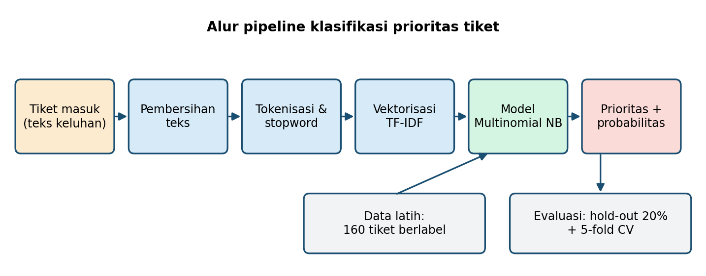
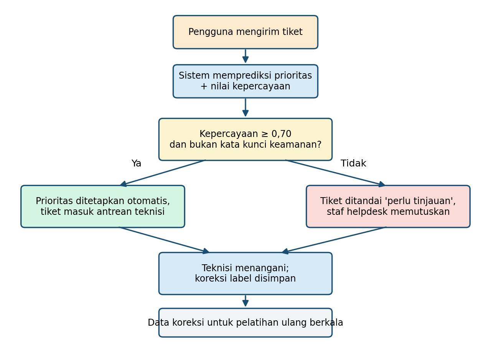

# Klasifikasi Prioritas Tiket Layanan TI (IT Helpdesk Kampus)

Tugas mandiri Praktikum Kecerdasan Buatan, Program Studi Sistem dan Teknologi Informasi.

**Bidang AI:** Machine Learning (klasifikasi teks)
**Algoritme:** TF-IDF + Multinomial Naive Bayes
**Penulis:** [Nama Nazwa Azzahra], NIM [2024606601025]

## Deskripsi singkat
Model memprediksi tingkat prioritas tiket helpdesk (Rendah / Sedang / Tinggi) dari teks
keluhan pengguna. Setiap prediksi disertai nilai kepercayaan. Tiket dengan kepercayaan
< 0,70 atau memuat kata kunci keamanan diteruskan ke petugas untuk ditinjau.

## Hasil utama
| Metrik | Nilai |
|---|---|
| Akurasi data uji (40 tiket) | 97,5% |
| Akurasi validasi silang 5 lipatan | 93,5% (SD 3,4) |

> Catatan: dataset adalah **200 tiket simulasi**, bukan data nyata, sehingga hasil
> tidak dapat langsung digeneralisasi ke data institusi sebenarnya.

## Isi repositori
| Berkas/Folder | Keterangan |
|---|---|
| `klasifikasi_tiket.ipynb` | Notebook untuk Google Colab |
| `klasifikasi_tiket.py` | Skrip yang sama dalam bentuk .py |
| `dataset_tiket_ti.csv` | Dataset simulasi 200 tiket |
| `buat_dataset.py` | Skrip pembangkit dataset simulasi |
| `gambar/` | Diagram rancangan (pipeline, alur keputusan) dan grafik hasil |
| `laporan/` | Laporan PDF |

## Cara menjalankan
**Google Colab:** buka `klasifikasi_tiket.ipynb`, unggah `dataset_tiket_ti.csv`, lalu Runtime > Run all.

**Lokal:**
```
pip install -r requirements.txt
python klasifikasi_tiket.py
```

## Diagram rancangan
   
   
